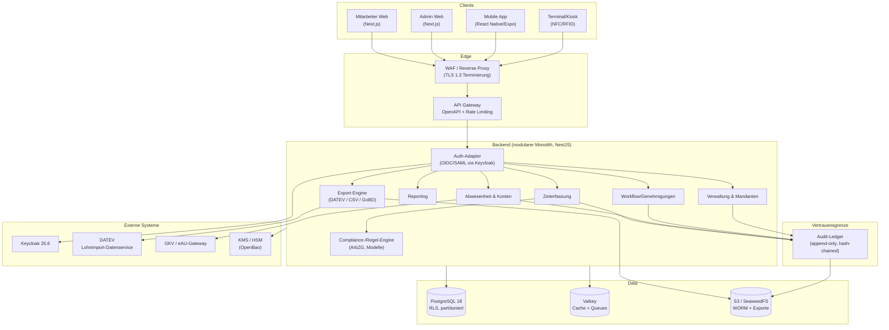

# Architekturplan – Enterprise-Zeiterfassung „ZeitVault“

> Produktname: **ZeitVault** (gewählt; passt zur „…Vault“-Linie von MigraVault). Markenrecherche (DPMA/EUIPO) und Domain-Sicherung vor Launch durchführen.
> Status: Architektur-Entwurf v1.1 · Zielgruppe: Entwicklung mit Claude Code · Sprache: Deutsch · Versionsstände: Stand Juni 2026
> Dieses Dokument ist die verbindliche Architektur-Grundlage für das Repository. Es beschreibt **das Was und Warum**, nicht jede Codezeile.

---

## 1. Produktvision

ZeitVault ist eine Enterprise-Zeiterfassung für den deutschen Markt, die **wahlweise selbst gehostet (On-Premises / im eigenen Rechenzentrum) oder als Cloud-/SaaS-Dienst** betrieben werden kann – aus **einer einzigen Codebasis**. Sie erfüllt die deutschen arbeits-, steuer- und datenschutzrechtlichen Anforderungen, ist auf höchstem Sicherheitsstandard gebaut, bietet Mitarbeitenden native Mobile-Apps und liefert Steuerberatern saubere Exporte (DATEV).

### Leitprinzipien

1. **Compliance by Design** – Arbeitszeitrecht, GoBD und DSGVO sind in der Datenmodellierung und in Workflows verankert, nicht nachträglich aufgesetzt.
2. **Revisionssicherheit** – einmal erfasste Zeiten sind unveränderbar; Korrekturen erzeugen versionierte, begründete Datensätze (lückenloser Audit-Trail).
3. **Eine Codebasis, zwei Betriebsmodelle** – Mandantenfähigkeit ist von Tag 1 im Modell. Self-Hosted = Single-Tenant-Konfiguration desselben Codes.
4. **Datensparsamkeit** – jede Erfassung von Standort-/Verhaltensdaten ist optional, transparent und mitbestimmungspflichtig.
5. **Einfachheit vor Funktionsfülle** – Mitarbeitende: ein Tap zum Ein-/Ausstempeln. Admins: klare Workflows statt Konfigurationsdschungel.
6. **Offene Schnittstellen** – alles, was die UI kann, kann auch die API (OpenAPI-dokumentiert).

---

## 2. Betriebsmodelle (Deployment)

| Aspekt | Self-Hosted (On-Premises) | Cloud / SaaS |
|---|---|---|
| Zielkunde | Datensensible Betriebe, Behörden, Kanzleien, Praxen | KMU, schnelle Inbetriebnahme |
| Mandanten | 1 Organisation pro Installation | n Organisationen (mandantengetrennt) |
| Auslieferung | Docker Compose (klein) / Helm-Chart auf Kubernetes (groß) | Kubernetes im DE/EU-Rechenzentrum |
| Datenhoheit | vollständig beim Kunden | Auftragsverarbeitung (AVV), DE/EU-Hosting |
| Updates | Kunde steuert Versionen (signierte Releases) | kontinuierlich durch DariaTech |
| Schlüsselverwaltung | Schlüssel beim Kunden (optional HSM) | KMS, optional kundenverwaltete Schlüssel (BYOK) |

**Architektur-Konsequenz:** Beide Modelle nutzen identische Container-Images. Unterschiede werden ausschließlich über Konfiguration (Env/Helm-Values) gesteuert – nie über getrennte Code-Branches. Self-Hosted läuft als Mandant mit `tenant_id = default` bei deaktivierter SaaS-Registrierung/Abrechnung.

---

## 3. Rechtlicher Rahmen (Deutschland)

Diese Anforderungen sind **funktionale Pflicht** und steuern Datenmodell, Validierungslogik und Aufbewahrung.

### 3.1 Arbeitszeiterfassungspflicht

Die Pflicht zur systematischen Arbeitszeiterfassung gilt in Deutschland bereits heute – abgeleitet aus dem EuGH-Urteil von 2019 (Rs. C-55/18) und dem BAG-Beschluss vom 13.09.2022 (Az. 1 ABR 22/21) auf Basis des Arbeitsschutzgesetzes. Ein eigenständiges „Arbeitszeiterfassungsgesetz“ als Novelle des ArbZG befindet sich im Gesetzgebungsverfahren (Referentenentwurf), war zum Stand Frühjahr 2026 aber noch nicht im Bundesgesetzblatt verkündet. Der Entwurf sieht insbesondere vor:

- **Beginn, Ende und Dauer** der täglichen Arbeitszeit werden grundsätzlich **elektronisch und am Tag der Arbeitsleistung** erfasst.
- Die **Verantwortung bleibt beim Arbeitgeber**, auch wenn die Erfassung an Mitarbeitende oder Dritte delegiert wird.
- **Vertrauensarbeitszeit bleibt zulässig**, jedoch nicht ohne Dokumentation – Verstöße gegen Höchst-/Ruhezeiten müssen erkennbar werden.
- Tendenz zur **wöchentlichen Höchstarbeitszeit (bis 48 h)** statt starrer Tagesgrenze (Flexibilisierung mit Ausgleichszeitraum).
- Voraussichtliche **Ausnahmen/Übergangsfristen für Kleinst-/Kleinbetriebe** und Sonderregeln für **leitende Angestellte** (§ 5 Abs. 3 BetrVG).

> **Architektur-Konsequenz:** Die Erfassungs- und Bewertungslogik wird **regelbasiert und versioniert** gebaut (siehe §10 „Regel-Engine“), damit Gesetzesänderungen (z. B. Umstieg täglich → wöchentlich) per Konfiguration/Regelpaket abgebildet werden können, ohne Datenmigration. Sanktionsrisiko bei Pflichtverletzung: behördliche Anordnung und Bußgeld bis 30.000 €.

### 3.2 Arbeitszeitgesetz (ArbZG) – aktive Prüfungen

Das System prüft und warnt in Echtzeit (konfigurierbar je Arbeitszeitmodell):

- Tägliche Höchstarbeitszeit (8 h, Ausdehnung auf 10 h mit Ausgleich) bzw. künftige Wochenlogik.
- **Ruhezeit** ≥ 11 h zwischen zwei Arbeitseinsätzen.
- **Pausen** (≥ 30 min ab 6 h, ≥ 45 min ab 9 h).
- Sonn- und Feiertagsarbeit (Dokumentation, Zuschlagsrelevanz).
- Jugendarbeitsschutz (JArbSchG) als optionales Regelpaket.

### 3.3 GoBD (Grundsätze ordnungsmäßiger Buchführung, elektronisch)

Zeitdaten sind lohn- und damit steuerrelevant. Daraus folgt:

- **Unveränderbarkeit & Nachvollziehbarkeit** – kein nachträgliches stilles Überschreiben; jede Änderung ist als neuer, begründeter Datensatz mit Zeitstempel, Urheber und Vorgängerbezug protokolliert.
- **Vollständigkeit & Zeitgerechtheit** – zeitnahe Erfassung, keine Lücken.
- **Aufbewahrungsfristen** – relevante Aufzeichnungen revisionssicher aufbewahren (Lohnunterlagen: i. d. R. 6 Jahre, buchungsrelevante 10 Jahre – konfigurierbar pro Mandant). Aufzeichnungen nach ArbZG ≥ 2 Jahre.
- **Maschinelle Auswertbarkeit & Datenzugriff** – Export im prüfbaren Format für Betriebsprüfung.
- **Verfahrensdokumentation** – das System liefert eine generierbare Verfahrensdokumentation (Datenfluss, Berechtigungen, Versionen).

### 3.4 DSGVO / BDSG (Beschäftigtendatenschutz)

- Rechtsgrundlage der Verarbeitung dokumentiert (Vertragserfüllung, gesetzliche Pflicht, ggf. Betriebsvereinbarung).
- **Datenschutz-Folgenabschätzung (DSFA)** vorbereiten – Beschäftigten-Zeit-/Standortdaten sind regelmäßig DSFA-pflichtig.
- **Betroffenenrechte**: Auskunft, Berichtigung, Löschung, Datenübertragbarkeit (mitarbeiterbezogener Export).
- **Spannungsfeld Löschung ↔ Aufbewahrung**: Daten unter steuerlicher Aufbewahrungspflicht werden **nicht gelöscht, sondern gesperrt/pseudonymisiert**, bis die Frist abläuft (siehe §12).
- **Verzeichnis von Verarbeitungstätigkeiten (VVT/RoPA)** und **AVV** für SaaS-Betrieb inkl. Subunternehmerliste.
- **Mitbestimmung (BetrVG §87)**: Einführung technischer Überwachungseinrichtungen ist mitbestimmungspflichtig → GPS/Geofencing standardmäßig **deaktiviert** und nur nach Betriebsvereinbarung aktivierbar.

### 3.5 Weitere Anforderungen

- **MiLoG** – Aufzeichnungspflichten in betroffenen Branchen (Zoll-Prüfung), automatische Erfassung mindestlohnrelevanter Stunden.
- **BFSG / Barrierefreiheit** – Web und App nach **WCAG 2.1 AA**.
- **eAU** – Anbindung der elektronischen Arbeitsunfähigkeitsbescheinigung (Abruf bei der Krankenkasse, siehe §15).

---

## 4. Funktionsumfang (Module)

**Kernmodule (MVP-relevant)**

- **Zeiterfassung**: Kommen/Gehen, Pausen, manuelle Nachträge (mit Begründung), Korrektur-Workflow.
- **Arbeitszeitmodelle**: Voll-/Teilzeit, Gleitzeit, Schicht, Vertrauensarbeitszeit; Sollzeit-Definition; Feiertagskalender je Bundesland.
- **Compliance-Engine**: Live-Prüfung ArbZG (Höchst-/Ruhezeit/Pausen), Warnungen, Verstoßprotokoll.
- **Abwesenheiten**: Urlaub (inkl. Resturlaub/Übertrag), Krankheit, Sonderurlaub – mit Genehmigungs-Workflow.
- **Arbeitszeitkonten**: Überstunden-/Gleitzeitsaldo, Auf-/Abbau, Kontoauszug.
- **Genehmigungen & Vertretungen**: mehrstufige Freigaben, Stellvertreter.
- **Reporting**: Stundenzettel, Saldenliste, Verstoßreport, Auswertungen je Abteilung/Kostenstelle.
- **Export**: DATEV LODAS / Lohn und Gehalt, DATEV Lohnimport-Datenservice (API), generisches CSV/Excel, GoBD-Prüfexport.
- **Verwaltung**: Mitarbeitende, Abteilungen, Standorte, Rollen/Rechte, Audit-Log.

**Erweiterungsmodule (spätere Phasen)**

- Dienst-/Schichtplanung, Projektzeiterfassung, Reisekosten/Spesen, Zutrittskontrolle (RFID/NFC-Terminal), digitale Personalakte, Self-Service-Portal-Erweiterungen.

---

## 5. Technologie-Stack

Bewusst **TypeScript-zentriert in einem Monorepo** – maximale Code-/Typ-Teilung zwischen Backend, Web und Mobile, exzellente Eignung für die Entwicklung mit Claude Code. Alle Versionen sind der **neueste stabile Stand mit Langzeit-Support** (Stand Juni 2026) – nicht „bleeding edge“ – damit spätere Updates planbar bleiben (Begründung siehe §5.1). Wo ein anderer Stack vertretbar wäre oder eine Lizenz beachtet werden muss, ist es vermerkt.

| Schicht | Technologie & Version (Juni 2026) | Begründung / Hinweis |
|---|---|---|
| **Monorepo** | Nx **21** *oder* Turborepo **2.x** + pnpm **10** | gemeinsame Typen/DTOs, Domain-Logik einmal geteilt |
| **Laufzeit/Sprache** | **Node.js 24 LTS** „Krypton“ (Support bis Apr 2028), **TypeScript 5.x** | bewusst Node **24 LTS** statt 26 (Current) – 26 wird erst Okt 2026 LTS; nie ungerade/Current-Linien in Produktion |
| **Backend/API** | **NestJS 11** (Express 5, SWC-Compiler) | modular, enterprise-tauglich, DI; benötigt Node 20+; *Alternative bei Team-Präferenz: .NET / Spring Boot* |
| **Datenbank** | **PostgreSQL 18** | neueste stabile Major (v19 noch Beta); RLS (Mandanten), Partitionierung, JSONB; 5 Jahre Support |
| **ORM/Migrations** | **Prisma 6** *oder* **Drizzle** (aktuell) | typsichere Schemata, nachvollziehbare Migrationen |
| **Auth/IdM** | **Keycloak 26.6** | OIDC + SAML, MFA/Passkeys, OpenTelemetry, Zero-Downtime-Updates; selbst hostbar – essenziell für On-Prem + Enterprise |
| **Web (Admin + Self-Service)** | **Next.js 16** + **React 19.2** + **Tailwind CSS v4** + shadcn/ui | Turbopack als Standard-Bundler; moderne, schnelle UI; ein Frontend mit rollenabhängigen Bereichen |
| **Mobile (iOS + Android)** | **Expo SDK 56** (**React Native 0.85**, React 19.2) | New Architecture + Hermes v1 (schnellerer Start, weniger Speicher); eine Codebasis, Offline-fähig |
| **API-Stil** | REST + **OpenAPI 3.1** (extern), tRPC (intern Web↔API) | breite Kompatibilität + typsichere interne Calls |
| **Async/Queues + Cache** | **Valkey 9.x** (BSD) + **BullMQ** | **statt Redis** (seit v8 nur noch AGPLv3 – Copyleft übers Netzwerk); Valkey ist BSD/Linux-Foundation, lizenzsicher für ein ausgeliefertes Produkt, RESP-kompatibel |
| **Objektspeicher (S3)** | Cloud: Object Storage des EU-Providers · Self-Host: **SeaweedFS** (Apache-2.0) oder **MinIO** (AGPLv3 – Lizenz prüfen) | Exportdateien, Anhänge, WORM-Ablage |
| **Audit-Ledger** | eigener **NestJS**-Service (append-only) | optional **Go** für hohen Durchsatz; siehe §9 |
| **Container/Orchestrierung** | **Docker** + Compose (klein) · **Helm/Kubernetes** (groß) | identische Images für beide Betriebsmodelle |
| **IaC** | **OpenTofu 1.12** (MPL-2.0) | **statt Terraform** (BSL, nicht OSI, IBM): OSI-Lizenz, EU-/CRA-freundlich, integrierte State-Verschlüsselung, drop-in |
| **Secrets** | **OpenBao** (MPL-2.0) *oder* SOPS | **statt HashiCorp Vault** (BSL): API-kompatibler Linux-Foundation-Fork; keine Klartext-Secrets, Rotation |
| **Observability** | **OpenTelemetry** + Prometheus + Grafana/Loki | als getrennte Ops-Tools betrieben (nicht ins Produkt eingebettet); Metriken, Tracing, Logs (datensparsam) |
| **CI/CD** | **GitHub Actions** | Build, Test, SAST/DAST, Dependency-/Container-Scan, **SBOM**, signierte Releases (Cosign) |

### 5.1 Versionsstrategie & Update-Sicherheit

„Auf dem neuesten Stand“ heißt für langfristige Update-Sicherheit **nicht** „immer die allerneueste Version“, sondern **neueste stabile Version mit Langzeit-Support, sauber gepinnt und kontrolliert aktualisiert**. Bleeding-Edge-Versionen (frisch erschienene Majors, Beta/Current-Linien) verursachen erfahrungsgemäß *mehr* Update-Schmerz, nicht weniger. Die Architektur folgt deshalb diesen Regeln:

1. **LTS bevorzugen.** Node.js nur in **LTS**-Linien (24 LTS jetzt; geplanter Wechsel auf 26 LTS nach dessen Promotion im Okt 2026). PostgreSQL auf der neuesten stabilen Major (18), nie auf Beta (19). Ubuntu-LTS-Basis-Images.
2. **Versionen festschreiben.** Lockfiles (`pnpm-lock.yaml`) committen, Docker-Base-Images per **Digest** pinnen, Helm-Chart-Versionen fixieren – reproduzierbare Builds.
3. **Updates automatisieren, aber kontrolliert.** **Renovate** (oder Dependabot) öffnet Update-PRs; die CI-Suite (Unit/Integration/E2E) entscheidet, ob gemerged wird. Patch/Minor laufen automatisiert, Majors als geplante, getestete Vorgänge.
4. **Nur unterstützte Versionen.** CI bricht ab, wenn eine Laufzeit/Abhängigkeit ihr End-of-Life erreicht (EOL-Check). Keine produktiven EOL-Komponenten.
5. **Lizenz-Stabilität als Update-Risiko mitdenken.** Re-Lizenzierungen (Redis, Terraform, Vault) sind faktisch Update-Hürden. Wo möglich werden **OSI-/permissiv lizenzierte, foundation-geführte** Bausteine gewählt (Valkey, OpenTofu, OpenBao) – das schützt vor erzwungenen Wechseln und passt zur EU-/Souveränitäts- und CRA-Logik.
6. **Breaking Changes isolieren.** Major-Upgrades nie mit Feature-Arbeit mischen; eigene PRs, eigener Test- und Staging-Durchlauf. Codemods nutzen, wo Anbieter sie bereitstellen (Next.js, Expo, NestJS).
7. **Architektur entkoppelt Volatiles.** Schnelldrehende Teile (Web/Mobile-Frameworks) sind über die geteilten `packages/` von der stabilen Domänenlogik getrennt; austauschbare Komponenten (Auth via Keycloak, Secrets via OpenBao) hängen an Standards (OIDC, Vault-API), nicht an einer Implementierung.

> **Ausblick Cyber Resilience Act (CRA):** Ab Dezember 2027 gelten EU-weit verpflichtende Anforderungen an Produkte mit digitalen Elementen (Schwachstellenmanagement, Update-Pflichten, SBOM, Meldewege). ZeitVault ist davon als ausgeliefertes Produkt betroffen – die Punkte oben (SBOM, signierte Releases, geordneter Update-Prozess, EOL-Disziplin) sind zugleich die CRA-Vorbereitung.

---

## 6. Systemarchitektur

Modularer Monolith für das Backend (klare Domänen-Module, später bei Bedarf als Services herauslösbar). Der **Audit-/Ledger-Dienst ist von Anfang an getrennt**, weil Revisionssicherheit eine harte Vertrauensgrenze braucht.



---

## 7. Mandantenfähigkeit (Tenancy)

- **Cloud/SaaS:** *pooled* Multi-Tenancy mit **PostgreSQL Row-Level Security**. Jede Tabelle führt `tenant_id`; RLS-Policies erzwingen Isolation auf DB-Ebene (kein versehentlicher Cross-Tenant-Zugriff, auch bei App-Bug). Für besonders regulierte oder große Kunden: optional **dedizierte Datenbank/Schema** (gleicher Code, andere Connection-Strategie).
- **Self-Hosted:** ein Mandant (`default`), RLS bleibt aktiv (kostet nichts, hält den Code einheitlich).
- **Tenant-Kontext** wird aus dem Auth-Token abgeleitet und je Request gesetzt; kein Request ohne gültigen Tenant-Kontext.

---

## 8. Datenmodell (Kern-Entitäten)

Vereinfachte Übersicht der zentralen Tabellen (alle mit `tenant_id`, Zeitstempeln, Soft-Delete-Sperre statt Hard-Delete bei aufbewahrungspflichtigen Daten):

- **Organization / Tenant** – Mandant, Einstellungen, Aufbewahrungs-/Regelkonfiguration.
- **Location** – Standort, Bundesland (→ Feiertagskalender), optionale Geofence-Definition.
- **Department** – Abteilung, Kostenstelle, Vorgesetzte.
- **Employee** – Stammdaten (datensparsam), Personalnummer, DATEV-Personalnummer, Beschäftigungsstatus, Rollen.
- **WorkTimeModel** – Sollzeiten, Gleitzeitregeln, Pausenregeln, gültig-ab/gültig-bis (versioniert).
- **TimeEntry** – **unveränderlicher** Erfassungsdatensatz: Beginn/Ende/Dauer, Quelle (Web/App/Terminal), Pausen, Status, `revision`, `previous_entry_id`, `correction_reason`.
- **Break** – Pausen, an TimeEntry gekoppelt.
- **AbsenceRequest** – Typ (Urlaub/Krankheit/…), Zeitraum, Status, Genehmiger, eAU-Referenz.
- **TimeAccount / AccountTransaction** – Salden (Überstunden, Urlaub) und jede buchende Transaktion.
- **ApprovalWorkflow / ApprovalStep** – Konfiguration und Instanzen.
- **WageTypeMapping** – Zuordnung interne Kategorie → DATEV-Lohnart / Ausfallschlüssel / Kostenstelle.
- **ExportJob** – jeder erzeugte Export (Zeitraum, Format, Prüfsumme, Ergebnisdatei in S3, Status) – reproduzierbar & protokolliert.
- **AuditEvent** – siehe §10, im separaten Ledger.
- **User / Role / Permission** – RBAC (+ ABAC-Attribute wie Abteilung/Standort).

> **Korrekturprinzip:** `TimeEntry` wird nie überschrieben. Eine Korrektur erzeugt einen neuen Datensatz mit erhöhter `revision`, Verweis auf den Vorgänger und Pflicht-Begründung. Reporting/Export nutzen immer die jeweils gültige Revision; die Historie bleibt vollständig.

---

## 9. Revisionssicherheit & Audit (GoBD-Kern)

Der **Audit-Ledger** ist der Vertrauensanker des Systems:

- **Append-only**: jede sicherheits-/lohnrelevante Aktion (Erfassung, Korrektur, Genehmigung, Export, Rechteänderung) schreibt ein unveränderliches `AuditEvent`.
- **Hash-Verkettung**: jedes Event enthält den Hash des Vorgängers (`prev_hash`) → eine fortlaufende, manipulationsevidente Kette. Nachträgliches Ändern/Löschen wird sofort erkennbar.
- **Periodische Versiegelung**: regelmäßiger Anker (signierter Tages-Hash) in WORM-S3-Ablage; optional qualifizierter Zeitstempel.
- **Trennung der Schreibrechte**: der Anwendungs-DB-User darf Audit-Events nur einfügen, nicht ändern/löschen (separater Service-Account / separater Speicher).
- **Verfahrensdokumentation**: generierbar aus Konfiguration + Schema + Regelversionen.

---

## 10. Regel-/Compliance-Engine

Damit Gesetzesänderungen (z. B. Tages- → Wochenhöchstarbeitszeit) ohne Code-Umbau abbildbar sind:

- Regeln liegen als **versionierte Regelpakete** vor (Höchstarbeitszeit, Ruhezeit, Pausen, Feiertage, Zuschläge).
- Jedes Arbeitszeitmodell referenziert ein Regelpaket mit Gültigkeitszeitraum.
- Die Engine arbeitet **deklarativ** (Bedingung → Bewertung/Warnung) und ist vollständig testbar (Property-/Snapshot-Tests gegen reale Szenarien).
- Bewertung läuft sowohl **live** (Warnung beim Stempeln) als auch **im Stapellauf** (Monatsabschluss, Verstoßreport).

---

## 11. Sicherheitsarchitektur

Ausrichtung auf höchsten Standard und Zertifizierungsfähigkeit:

- **Rahmenwerke**: BSI IT-Grundschutz als Leitlinie; **BSI C5** für das Cloud-Angebot; **ISO/IEC 27001**-Readiness; Krypto nach BSI **TR-02102**, TLS-Konfiguration nach **TR-03116**.
- **Verschlüsselung**: AES-256 *at rest* (DB + Objektspeicher), **TLS 1.3** *in transit*, **Envelope-Encryption** über KMS; optional **kundenverwaltete Schlüssel (BYOK)** und HSM für On-Prem.
- **Feldverschlüsselung** für besonders sensible Felder (z. B. eAU-Bezug).
- **Identität & Zugriff**: OIDC/SAML via Keycloak, **MFA-Pflicht** für Admins, **RBAC + ABAC** (Standort/Abteilung), Prinzip der minimalen Rechte.
- **Netzwerk**: Zero-Trust-Segmentierung, WAF, striktes Rate-Limiting, keine direkte DB-Exposition.
- **Secrets**: OpenBao (MPL-2.0) / SOPS, automatische Rotation, keine Secrets im Repo.
- **Software-Lieferkette**: SAST + DAST + Dependency-/Container-Scanning in CI, **SBOM** je Release, **signierte Images/Releases** (Cosign), reproduzierbare Builds.
- **Audit-Zugriff**: jeder lesende Zugriff auf personenbezogene Daten ist protokolliert.
- **Betrieb**: getestete Backups (3-2-1, verschlüsselt), dokumentierter DR-Plan, regelmäßige Penetrationstests vor Major-Releases.

---

## 12. Datenschutz / DSGVO (konkrete Umsetzung)

- **Datenresidenz**: Cloud ausschließlich in **deutschen/EU-Rechenzentren** (z. B. Hetzner, IONOS, OVHcloud EU) – keine Drittlandübermittlung ohne Garantien.
- **Datensparsamkeit**: GPS/Geofencing **standardmäßig aus**, nur per Betriebsvereinbarung aktivierbar; keine heimliche Verhaltensüberwachung.
- **Betroffenenrechte als Funktionen**: Self-Service-Auskunft, Berichtigung über Korrektur-Workflow, **Datenexport** (maschinenlesbar) je Mitarbeiter.
- **Löschen vs. Aufbewahren**: aufbewahrungspflichtige Daten werden bei Austritt **gesperrt/pseudonymisiert** und erst nach Fristablauf automatisiert gelöscht (Retention-Engine je Mandant konfigurierbar).
- **Dokumente**: generierbares **VVT/RoPA**, **AVV-Vorlage** inkl. **Subunternehmerliste** (für SaaS), Bausteine für die **DSFA**.
- **Einwilligungs-/Mitbestimmungsnachweis**: aktivierte sensible Funktionen werden mit Rechtsgrundlage/Betriebsvereinbarung dokumentiert.

---

## 13. Mobile Apps (Mitarbeitende)

- **React Native (Expo)** für iOS und Android aus einer Codebasis; teilt DTO-/Typdefinitionen mit dem Backend.
- **Offline-First**: Ein-/Ausstempeln funktioniert ohne Netz und synchronisiert konfliktfrei nach (lokale Queue, idempotente Sync-Endpunkte). Wichtig für Außendienst/Baustelle/Funklöcher.
- **Ein-Tap-Bedienung**: großer Kommen/Gehen-Button, Pausen, Tagesübersicht, Salden (Überstunden/Urlaub), Urlaubsantrag, Push-Benachrichtigungen (Genehmigungen, Erinnerungen).
- **Sicherheit**: biometrisches Entsperren, Token-basierte Auth (kurze Lebensdauer + Refresh), Zertifikats-Pinning, kein dauerhaftes Klartext-Caching sensibler Daten.
- **Optional**: NFC/Badge am Terminal, geofence-gestützte Plausibilisierung (nur bei Aktivierung).

---

## 14. UI/UX-Konzept

- **Zwei Erlebnisse, ein Designsystem**: Admin-Konsole (Dashboards, Verwaltung, Freigaben, Reports, Export) und Mitarbeiter-Self-Service (stempeln, Salden, Anträge). Rollenabhängige Sichtbarkeit.
- **Sehr einfache Bedienung**: klare Primäraktionen, geführte Workflows, sinnvolle Defaults, deutschsprachig, kontextsensitive Warnungen statt Fehlermeldungen.
- **Modernes, ruhiges Interface**: konsistente Komponenten (shadcn/ui + Tailwind), Hell-/Dunkelmodus, schnelle Ladezeiten.
- **Barrierefreiheit**: WCAG 2.1 AA (Tastaturbedienung, Kontraste, Screenreader) – auch wegen BFSG.
- **Terminal/Kiosk-Modus** für gemeinsam genutzte Geräte am Standort.

---

## 15. Steuerberater-Export & Integrationen

### 15.1 DATEV (zentral)

DATEV ist in deutschen Kanzleien Quasi-Standard. ZeitVault unterstützt:

- **DATEV LODAS** und **DATEV Lohn und Gehalt** als Datei-Export (ASCII/`.txt`, Bewegungs- und bei Bedarf Stammdaten), zum manuellen Import in der Kanzlei.
- **DATEV Lohnimport-Datenservice (API)** für direkte, automatisierte Übergabe (erfordert Registrierung/Berater- und Mandantennummer bei DATEV).
- **Mapping-Engine**: interne Kategorien (Arbeitszeit, Überstunden, Zuschläge, Urlaub, Krankheit …) werden je Mandant auf **DATEV-Lohnarten**, **Ausfallschlüssel** und **Kostenstellen** abgebildet. Pro Personaltyp eigene Profile.
- **Monatslauf**: aus geprüften, freigegebenen Zeiten entstehen fertige Buchungssätze; Export pro Abrechnungszeitraum, **reproduzierbar und protokolliert** (jeder Export als `ExportJob` mit Prüfsumme – GoBD).

> Die exakten Feldlayouts stammen aus der offiziellen **DATEV-Schnittstellenbeschreibung** (über DATEV zu beziehen). Diese ist im Repo als verbindliche Referenz zu hinterlegen; die Mapping-Tabellen werden daraus abgeleitet (kein Raten).

### 15.2 Weitere Exporte

- **Generisches CSV/Excel** für Steuerberater ohne DATEV.
- **GoBD-Prüfexport** für Betriebsprüfungen (maschinell auswertbar).
- **PDF-Stundenzettel** pro Mitarbeiter/Monat.

### 15.3 eAU (elektronische AU-Bescheinigung)

Abruf von Arbeitsunfähigkeitsdaten bei der Krankenkasse über ein zertifiziertes Gateway, automatische Übernahme als Abwesenheit. Anbindung als gekapselter Integrationsdienst (asynchron via Queue), da hier besondere Zertifizierungs-/Sicherheitsanforderungen gelten.

---

## 16. Infrastruktur & DevOps

- **Images**: ein Satz signierter Container-Images für alle Komponenten.
- **Self-Hosted klein**: Docker Compose (App, PostgreSQL, Valkey, SeaweedFS/MinIO, Keycloak, OpenBao) – Inbetriebnahme in Minuten.
- **Self-Hosted/Cloud groß**: **Helm-Chart** auf Kubernetes, horizontal skalierbar, Health-/Readiness-Probes, rollierende Updates.
- **Cloud-Hosting**: DE/EU-Rechenzentrum, **OpenTofu**-provisioniert, automatisierte Backups, Monitoring/Alerting.
- **CI/CD (GitHub Actions)**: Lint → Test (Unit/Integration/E2E) → Security-Scans → SBOM → Build → Signatur → Release. Pull-Request-Pflicht, Branch-Protection.
- **Releases**: SemVer, signiert; Self-Hosted-Kunden steuern Versionen selbst.
- **Observability**: OpenTelemetry-Tracing, Prometheus-Metriken, Grafana-Dashboards, Loki-Logs (ohne unnötige Personenbezüge).

---

## 17. Repository-Struktur (für Claude Code)

```text
zeitvault/
├─ apps/
│  ├─ api/                 # NestJS Backend (modularer Monolith)
│  ├─ web/                 # Next.js (Admin + Self-Service)
│  ├─ mobile/              # React Native (Expo)
│  └─ ledger/              # Audit-Ledger-Service (append-only)
├─ packages/
│  ├─ domain/              # geteilte Domänenlogik (Regeln, Berechnungen)
│  ├─ types/               # geteilte DTOs/Typen (API ↔ Web ↔ Mobile)
│  ├─ ui/                  # geteilte UI-Komponenten / Designsystem
│  └─ config/              # ESLint, TS-Config, Konventionen
├─ infra/
│  ├─ docker/              # Compose für Self-Hosted
│  ├─ helm/                # Helm-Chart für Kubernetes
│  └─ tofu/                # Cloud-Provisionierung (OpenTofu)
├─ docs/
│  ├─ ARCHITEKTUR.md       # dieses Dokument
│  ├─ adr/                 # Architecture Decision Records
│  ├─ compliance/          # GoBD, DSGVO (VVT, AVV, DSFA), DATEV-Referenz
│  └─ api/                 # generierte OpenAPI-Spezifikation
├─ CLAUDE.md               # Konventionen & Leitplanken für Claude Code
├─ SECURITY.md
├─ CONTRIBUTING.md
└─ README.md
```

**Empfehlung für Claude Code:** Eine **`CLAUDE.md`** im Root mit verbindlichen Konventionen (Stack, Testpflicht, „TimeEntry niemals überschreiben“, „jede lohnrelevante Aktion erzeugt ein AuditEvent“, Commit-/PR-Regeln). Jede nicht-triviale Entscheidung als **ADR** in `docs/adr/`. Die DATEV-Schnittstellenbeschreibung und ein Compliance-Glossar gehören als Referenz ins Repo, bevor das Export-Modul gebaut wird.

---

## 18. Entwicklungs-Roadmap (Phasen)

| Phase | Inhalt | Ergebnis |
|---|---|---|
| **0 – Fundament** | Monorepo, CI/CD, Auth (Keycloak), Mandanten/RLS, Kern-Datenmodell, Audit-Ledger, Compose-Setup | lauffähiges Gerüst, sicher & mandantenfähig |
| **1 – MVP Zeiterfassung** | Kommen/Gehen Web + Mobile, Pausen, Korrektur-Workflow, ArbZG-Live-Prüfung, Basis-Admin | rechtssicheres Stempeln, online demonstrierbar |
| **2 – Abwesenheit & Konten** | Urlaub/Krankheit, Genehmigungen, Arbeitszeitkonten, Feiertagskalender | vollständiger Arbeitsalltag abgedeckt |
| **3 – Export & Reporting** | DATEV LODAS/Lohn und Gehalt, Mapping-Engine, GoBD-Prüfexport, Stundenzettel, Auswertungen | Steuerberater-Anbindung produktiv |
| **4 – Cloud-Härtung** | Multi-Tenant-SaaS, Helm/K8s, Billing, BYOK, C5-/ISO-Vorbereitung | SaaS-Angebot startklar |
| **5 – Zertifizierung & Ausbau** | Penetrationstest, eAU, Dienstplan/Projektzeit, Zertifizierungen | Enterprise-Reife |

---

## 19. Annahmen & offene Entscheidungen

- **Produktname ZeitVault** ist gewählt; Markenrecherche (DPMA/EUIPO) und Domain-Sicherung (.de/.com) stehen noch aus und sollten vor dem Launch erfolgen.
- **Versionsstände** in §5 sind der Stand Juni 2026 (neueste stabile/LTS-Versionen). Sie werden über Renovate + EOL-Checks gepflegt (§5.1); konkrete Patch-Stände beim Projektstart per Lockfile fixieren.
- **OSI-/permissive Bausteine** (Valkey, OpenTofu, OpenBao statt Redis/Terraform/Vault) sind bewusst gewählt, um Lizenz- und Souveränitätsrisiken zu vermeiden – bei abweichender Strategie als ADR dokumentieren.
- **TypeScript-Stack** ist gesetzt für beste Claude-Code-Eignung; bei interner .NET-/Java-Präferenz ist das Backend austauschbar (Architektur bleibt gültig).
- **DATEV-Registrierung** (Berater-/Mandantennummer, API-Zugang) muss organisatorisch beschafft werden – blockiert sonst Phase 3.
- **eAU-Anbindung** erfordert ein zertifiziertes Gateway/Provider – als externe Abhängigkeit einplanen.
- **Rechtslage Arbeitszeitgesetz** ist in Bewegung: Architektur ist über die Regel-Engine vorbereitet; finalen Gesetzestext bei Verkündung als neues Regelpaket einpflegen.
- **Cloud-Provider** (Hetzner/IONOS/OVH …) und **KMS/HSM** für die Envelope-Verschlüsselung sind noch zu fixieren (ADR); OpenBao deckt die Secret-Verwaltung ab, das KMS für Schlüssel-Wrapping ist davon getrennt zu wählen.
- **Lizenzmodell** des Codes (proprietär vs. teils offen) ist Produktentscheidung von DariaTech.

---

## 20. Nächste Schritte

1. Markenrecherche (DPMA/EUIPO) für **ZeitVault** beauftragen, Domains (.de/.com) sichern, Lizenzmodell festlegen.
2. Repo anlegen, `CLAUDE.md` + erste ADRs schreiben (Stack inkl. Versionsstrategie, Tenancy, Audit-Ledger, OSI-Bausteine).
3. DATEV-Schnittstellenbeschreibung beschaffen und in `docs/compliance/` ablegen.
4. Phase 0 mit Claude Code starten (Gerüst, Auth, Datenmodell, Ledger, Compose) – Versionen aus §5 per Lockfile/Digest pinnen, Renovate + EOL-Check aktivieren.
5. Frühzeitig Betriebsrat/Datenschutz einbinden (DSFA, Betriebsvereinbarung für sensible Funktionen).

---

*Hinweis: Dieses Dokument fasst rechtliche Rahmenbedingungen für die technische Planung zusammen und ersetzt keine Rechtsberatung. Für die verbindliche Auslegung von ArbZG, GoBD und DSGVO sowie für DATEV-Formate sind die offiziellen Quellen bzw. fachkundige Beratung maßgeblich.*
